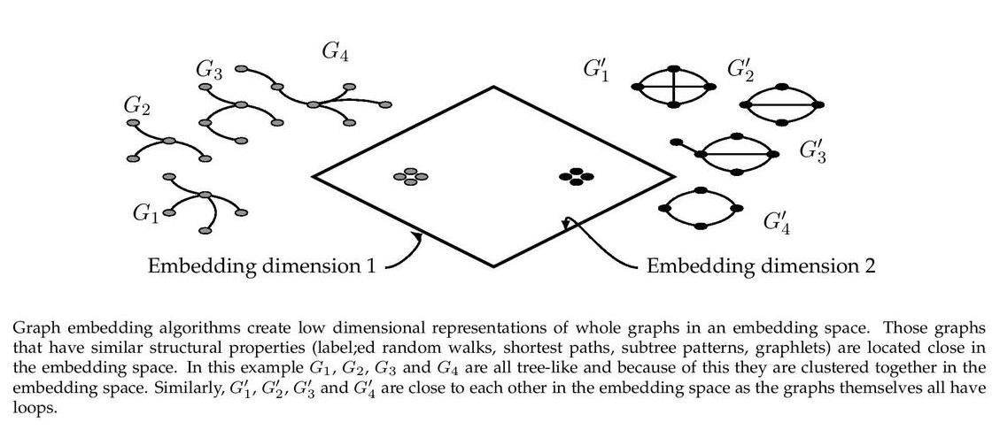

Graph2Vec
------------

[](https://arxiv.org/abs/1707.05005) [](https://codebeat.co/projects/github-com-benedekrozemberczki-graph2vec-master) [](https://github.com/benedekrozemberczki/Graph2Vec/archive/master.zip) [](https://twitter.com/intent/follow?screen_name=benrozemberczki)

### Abstract
------------

<p align="justify">Recent works on representation learning for graph structured data predominantly focus on learning distributed representations of graph substructures such as nodes and subgraphs. However, many graph analytics tasks such as graph classification and clustering require representing entire graphs as fixed length feature vectors. While the aforementioned approaches are naturally unequipped to learn such representations, graph kernels remain as the most effective way of obtaining them. However, these graph kernels use handcrafted features (e.g., shortest paths, graphlets, etc.) and hence are hampered by problems such as poor generalization. To address this limitation, in this work, we propose a neural embedding framework named graph2vec to learn data-driven distributed representations of arbitrary sized graphs. graph2vec's embeddings are learnt in an unsupervised manner and are task agnostic. Hence, they could be used for any downstream task such as graph classification, clustering and even seeding supervised representation learning approaches. Our experiments on several benchmark and large real-world datasets show that graph2vec achieves significant improvements in classification and clustering accuracies over substructure representation learning approaches and are competitive with state-of-the-art graph kernels. 
</p>
<p align="center">
  
</p>

The model is now also available in the package [Karate Club](https://github.com/benedekrozemberczki/karateclub).

This repository provides an implementation for *graph2vec* as it is described in:
> graph2vec: Learning distributed representations of graphs.
> Narayanan, Annamalai and Chandramohan, Mahinthan and Venkatesan, Rajasekar and Chen, Lihui and Liu, Yang
> MLG 2017, 13th International Workshop on Mining and Learning with Graphs (MLGWorkshop 2017).

The original TensorFlow implementation is available [[here]](https://github.com/MLDroid/graph2vec_tf).

### Requirements

The codebase is implemented in Python 3.5.2 | Anaconda 4.2.0 (64-bit). Package versions used for development are just below.
```
jsonschema        2.6.0
tqdm              4.28.1
numpy             1.15.4
pandas            0.23.4
texttable         1.5.0
gensim            3.6.0
networkx          2.4
joblib            0.13.0
logging           0.4.9.6  
```

### Datasets
<p align="justify">
The code takes an input folder with json files. Every file is a graph and files have a numeric index as a name. The json files have two keys. The first key called "edges" corresponds to the edge list of the graph. The second key "features" corresponds to the node features. If the second key is not present the WL machine defaults to use the node degree as a feature.  A sample graph dataset from NCI1 is included in the `dataset/` directory.</p>

### Options

Learning of the embedding is handled by the `src/graph2vec.py` script which provides the following command line arguments.

#### Input and output options
```
  --input-path   STR    Input folder.           Default is `dataset/`.
  --output-path  STR    Embeddings path.        Default is `features/nci1.csv`.
```
#### Model options
```
  --dimensions     INT          Number of dimensions.                             Default is 128.
  --workers        INT          Number of workers.                                Default is 4.
  --epochs         INT          Number of training epochs.                        Default is 1.
  --min-count      INT          Minimal feature count to keep.                    Default is 5.
  --wl-iterations  INT          Number of feature extraction recursions.          Default is 2.
  --learning-rate  FLOAT        Initial learning rate.                            Default is 0.025.
  --down-sampling  FLOAT        Down sampling rate for frequent features.         Default is 0.0001.
```

### Examples
<p align="justify">
The following commands learn an embedding of the graphs and writes it to disk. The node representations are ordered by the ID. Creating a graph2vec embedding of the default dataset with the default hyperparameter settings. Saving the embedding at the default path.</p>

```sh
$ python src/graph2vec.py
```

Creating an embedding of an other dataset. Saving the output in a custom place.

```sh
$ python src/graph2vec.py --input-path new_data/ --output-path features/nci2.csv
```

Creating an embedding of the default dataset in 32 dimensions.

```sh
$ python src/graph2vec.py --dimensions 32
```
-----------------------------------------------

**License**

- [GNU License](https://github.com/benedekrozemberczki/graph2vec/blob/master/LICENSE)
